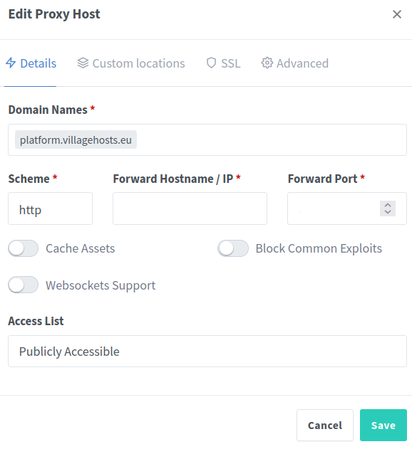
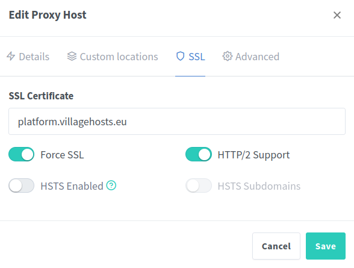

# Platform for the Open School of Village Hosts - Erasmus+ VET project

## Installation

1. *git clone https://github.com/openp2pdesign/OSVH_Platform.git* (See also all the options for cloning in GitHub) / or Download this repository and unzip the file 
2. modify the usernames and passwords environment files (.env_w, .env_m, .env_l) you need to create a username and a password for each system
3. if using the git repo, create a .gitgnore file with them (.env_w, .env_m, .env_l) in it to avoiding overwriting / committing your passwords
4. Wordpress: copy your plugins/themes/uploads in the *installation/wordpress/wp-content/* folder (in each respective subfolder), and they will be installed - this is especially for proprietary and own content not to be shared
5. Moodle: copy your plugins/themes in the *installation/moodle/* folder (in each respective subfolder), and they will be installed - this is especially for proprietary and own content not to be shared
6. Launch the containers with *docker-compose up -d*
7. Go to DOMAIN:9000 to create your Portainer admin account
8. Go to DOMAIN:8083 to configure domains & SSL certificates for Wordpress, Moodle, Limesurvey, etc., with Nginx Proxy Manager.
   Please carefully read the Nginx Proxy Manager documentation: 
   You have to fill your Domain Names, the IP address and port for each server on the your Host server.

9. Then, for each Domain you have to ask for a SSL certificate. Please select Force SSL and HTTP/2 support options. 

10. Finally you should go to Wordpress and access the wp-config.php on your docker instance.

    Then add this to the file:

    Add following at top of wp-config.php  
    
    define('FORCE_SSL_ADMIN', true);
    
    if (strpos($_SERVER['HTTP_X_FORWARDED_PROTO'], 'https') !== false){
        $_SERVER['HTTPS'] = 'on';
        $_SERVER['SERVER_PORT'] = 443;
    }
    if (isset($_SERVER['HTTP_X_FORWARDED_HOST'])) {
        $_SERVER['HTTP_HOST'] = $_SERVER['HTTP_X_FORWARDED_HOST'];
    }
    
    Add following at end of wp-config.php. Repalce example.com with your domain name
    
    define('WP_HOME','https://example.com/');
    define('WP_SITEURL','https://exampe.com/');

